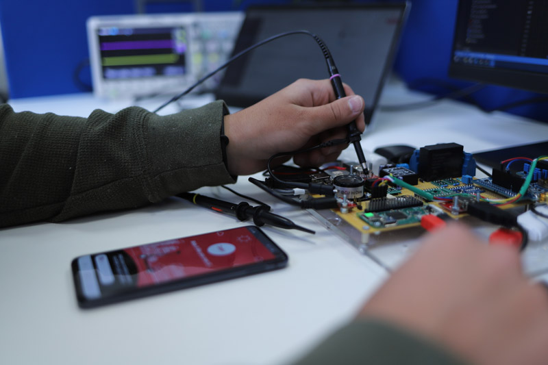
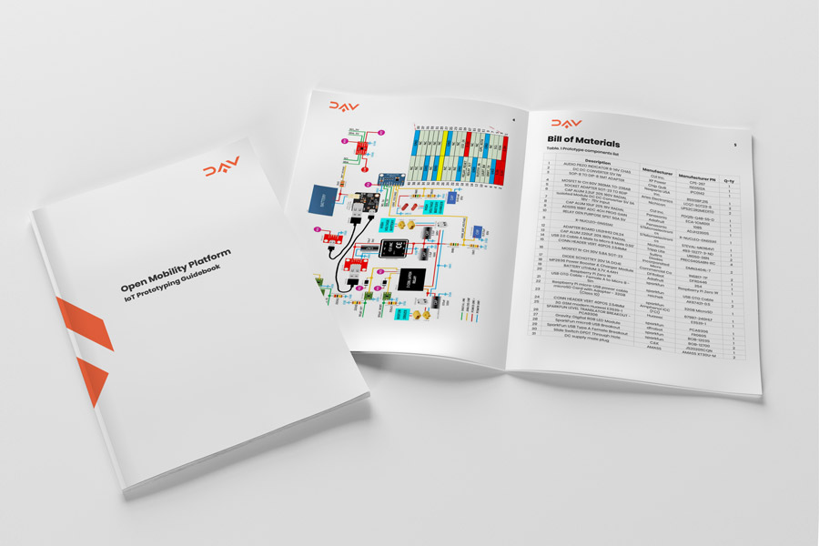

# Open Mobility Platform IoT

### Rapid-Prototyping Platform for Micro-Mobility
An open platform for rapid prototyping of Micro-Mobility IoT projects. Compatible with mooving projects and the DAV network.

The rapid-prototyping platform allows anyone to create their own connected micro-mobility vehicles, combine it with their own projects or the mooving software projects, and launch their own fleet.

### Getting Started

Complete instructions for getting started are available in the IoT Prototyping Guidebook.

The guidebook includes:

1. Detailed Bill of Materials
2. Instructions for the High Power Switch assembly
3. Instructions for the Voltage Sense assembly
4. Instructions for the High Voltage DCDC assembly
5. Instructions for the Buzzer driver assembly
6. Instructions for the Internal Battery Controller assembly
7. Instructions for the LED Indication assembly 
8. Instructions for the Accelerometer assembly
9. Instructions for the GPS Module and USB UART Bridge assembly 
10. Instructions for the Logic Level Translator assembly
11. Instructions for installing the Raspberry Pi and 3G Modem 
12. Connecting Your Device to the Cloud
13. Firmware Installation
14. Sample connection instructions to the Xiaomi M365 scooter

[📘 Get started here](https://github.com/DAVFoundation/mooving-iot-firmware/blob/master/documentation/Mooving%20IoT%20Guidebook.pdf)
